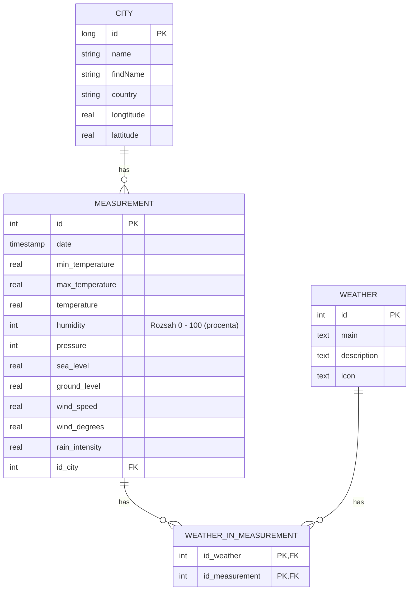

# painstorm
Semestrální projekt pro udělení zápočtu na předmět MTI/RDB (Řízení databází) 2024/25


## Databáze a verzování

Je potřeba mít v složce repozitáře `.env`, jenž vypadá následovně 
```
POSTGRES_USER=user
POSTGRES_PASSWORD=heslo
POSTGRES_DB=painstorm
MONGO_INITDB_ROOT_USERNAME=hehe
MONGO_INITDB_ROOT_PASSWORD=hehe

```

## Požadavky
- Dle zadání uživatele stahovat data o aktuálním počasí, n dní do minulosti pro dané místo
    - Maximálně 7 dní dozadu
- Používat relační db jako cache, 
    - Pokud už daná data budu mít v db pak se již nebudu ptát API
    - umět jak dle místa tak i souřadnic
- Nad strukturovanými daty pak umět hledat:
    - Všechna místa kde v daný den nebo rozmezí dnů pršelo s danou intenzitou.
    - Najít dny v definovaném rozmezí, kdy pro dané místo bylo stále stejné počasí zadané jako parametr a pro tyto dny z JSON získat parametry clouds a cnt
    - Najít místa, kde v daný den byl největší rozdíl teplot
- Navrhnou systém pro mazání záznamů z DBs dle retention period
- Umět pro testovací účely vygenerovat n záznamů (pro ověření rychlosti mazání a vyhledávání)
- Navrhnout odpovídající indexy
- Používat systém pro verzování schématu relační DB (liquibase, flyway)
    - Používáme flyway, protože jsme chudí.
- Libovolný jazyk a DB 
    - Backend v golang
    - Frontend v Sveltekit, Tailwind a Shadcn-svelte

## Schémata

